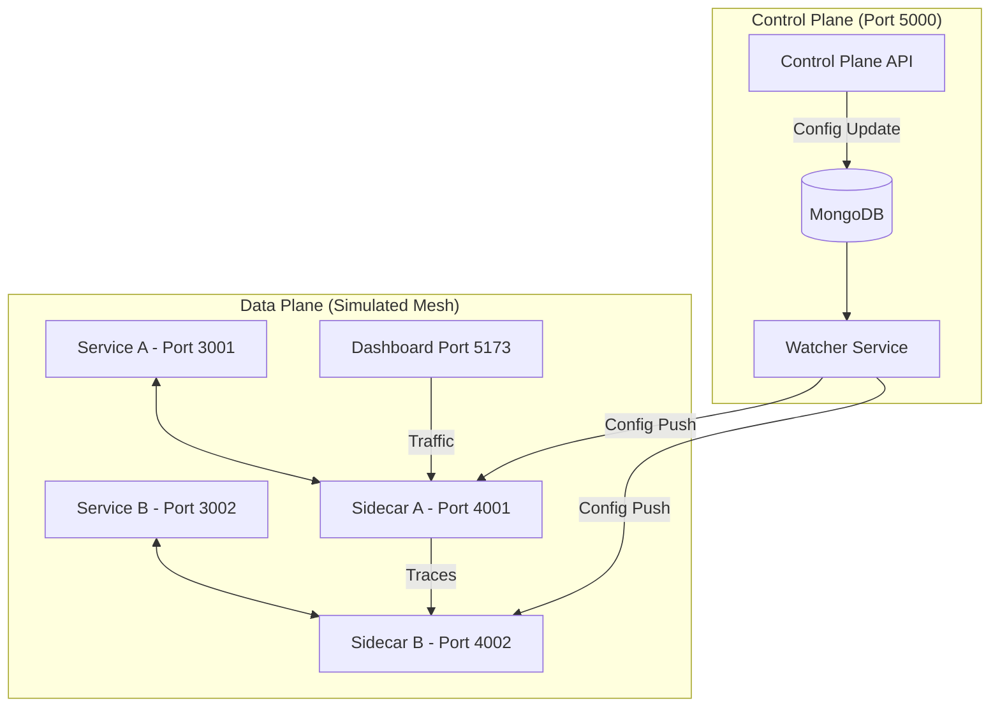

# 🕸️ Mini-Istio Service Mesh Explorer

[](#) 
[](#) 
[](#)
[](#)

Welcome to the **Mini-Istio Service Mesh Explorer**! This is a production-grade educational project designed to visualize and teach advanced cloud-native architecture concepts. It simulates how a **Service Mesh** (like Istio) manages traffic, discovery, and resilience in a microservices environment.

---

## 📖 Table of Contents
- [✨ Key Features](#✨-key-features)
- [🏗️ Architectural Overview](#🏗️-architectural-overview)
- [📂 Project Structure](#📂-project-structure)
- [🛠️ Tech Stack](#🛠️-tech-stack)
- [🚀 Getting Started](#🚀-getting-started)
- [💡 Demonstration: The Circuit Breaker](#💡-demonstration-the-circuit-breaker)
- [🎓 Technical Q&A (Viva Notes)](#🎓-technical-qa-viva-notes)

---

## ✨ Key Features
- **🚀 Topology Visualization**: Watch live traffic flow between microservices with animated tracer particles.
- **🛡️ Data Plane (Sidecars)**: Every service has its own dedicated proxy (Sidecar) that handles all networking logic.
- **🧠 Control Plane**: A central brain that pushes configuration updates to all sidecars in real-time.
- **🔥 Dynamic Circuit Breaker**: Simulate service failures and watch the mesh automatically "trip" the circuit to prevent cascading errors.
- **🔄 Real-time Configuration**: Powered by MongoDB Change Streams and Webhooks for instant policy propagation.

---

## 🏗️ Architectural Overview

This project follows the **Sidecar Pattern**, decoupling networking from business logic.



---

## 📂 Project Structure

```text
.
├── 🎮 control-plane/       # The "Brain" - Manages state and configuration
│   ├── src/config/        # Configuration schema and DB connection
│   └── index.js           # Server logic for managing the service registry
├── 📡 sidecar/             # The Proxy - Intercepts and manages service traffic
│   ├── src/               # Core proxy logic and Circuit Breaker logic
│   └── index.js           # Express server running as the local proxy
├── 📦 service-a/           # Microservice A (The Frontend API Caller)
│   └── index.js           # Simple Node service that talks to Sidecar A
├── 📦 service-b/           # Microservice B (The Data API - 30% failure rate)
│   └── index.js           # Simulated backend with random failure logic
├── 👁️ watcher/             # The Monitor - Propagates DB changes to sidecars
│   └── index.js           # MongoDB Change Stream listener
├── 🖥️ frontend/            # The GUI Dashboard (React + Vite)
│   ├── src/               # React components and Topology visualizers
│   └── index.html         # Main entry point
├── 📜 start_all.bat        # Windows automation script to launch everything
├── 📜 deploy.sh            # Unix deployment script
├── 📜 package.json         # Root monorepo configuration
└── 📜 README.md            # You are here!
```

---

## 🛠️ Tech Stack
- **Backend**: Node.js, Express.js
- **Frontend**: React (Vite), Tailwind CSS, Framer Motion
- **Database**: MongoDB (Atlas)
- **Communication**: HTTP/1.1 (Simulated Mesh), Webhooks
- **Visualization**: Custom Canvas-based Topology Engine

---

## 🚀 Getting Started

### Prerequisites
- [Node.js](https://nodejs.org/) (v16+)
- MongoDB Atlas account (or Local Instance)

### Quick Setup

1. **Clone & Install**:
   ```bash
   git clone https://github.com/Abhaykauahal21/Istio-service.git
   cd Istio-service
   npm run install:all
   ```

2. **Environment Variables**:
   Update the `MONGO_URI` in `package.json` or create a `.env` in the root (if required by your configuration).

3. **Launch the Mesh**:
   ```bash
   npm start
   ```
   *(Windows: You can also double-click `start_all.bat`)*

4. **Visit Dashboard**: [http://localhost:5173](http://localhost:5173)

---

## 💡 Demonstration: The Circuit Breaker

The core value of this project is demonstrating **Resilience**.

1.  Open the **Topology Hub** on the dashboard.
2.  Go to the **Security Tab** and set "Failure Threshold" to **1 Strike**.
3.  Click **Push Config** (This uses the Watcher Service to update Sidecars).
4.  Navigate back to **Topology** and click **Fire Traffic**.
5.  When `Service B` (which fails 30% of the time) returns an error, the **Sidecar** will instantly detect it, trip the circuit, and the UI will show the connection snap into **OPEN (RED)** state.

---

## 🎓 Technical Q&A (Viva Notes)

1.  **What is a Service Mesh?**
    It's an infrastructure layer that handles service-to-service communication, security, and observability without modifying the application code.
2.  **Why use a Sidecar?**
    To offload network concerns (retries, timeouts, circuit breaking) from the developer. The app only talks to `localhost`.
3.  **How is Config Propagated?**
    We use **MongoDB Change Streams**. The `Watcher` service listens for DB updates and immediately sends a Webhook push to all active Sidecars.
4.  **Control Plane vs. Data Plane?**
    **Control Plane**: The Brain (sets policies). **Data Plane**: The Muscle (Sidecars that actually handle traffic).

---
*Built with ❤️ by Abhay Kaushal along with Team for Cloud Architecture Education.*